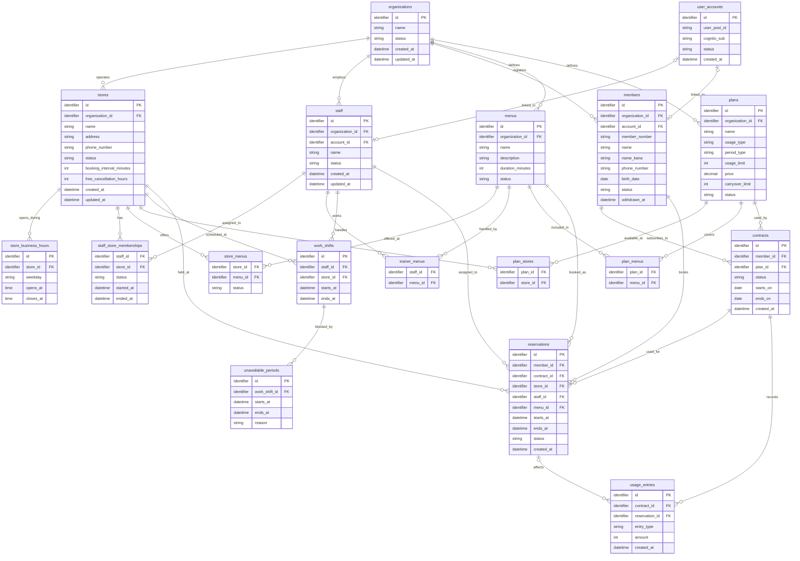

# テーブル設計書

## 全体ER図（たたき台）

Phase 1の主要なデータと関係を示す。列名、型、制約は仮置きであり、各テーブルを確認しながら確定する。営業時間、役割、変更履歴などの補助的なテーブルも、その際に追加する。図の型は概要を読むための表記であり、PostgreSQLの型は未決定である。

最初に確認する関係は事業者と店舗とする。一つの事業者は複数の店舗を持ち、各店舗は一つの事業者に属する。`stores.organization_id`は`organizations.id`を指す。

## organizations（事業者）

1行が、SaaSを利用するジム事業者1つを表す。事業者の店舗、会員、スタッフなどを結びつける起点となる。

| 列 | 必須 | 意味 |
| --- | --- | --- |
| `id` | はい | 名称が変わっても変わらない事業者の識別子。主キー |
| `name` | はい | 画面などに表示する事業者名 |
| `status` | はい | 現在の利用状態。`preparing`、`active`、`suspended`、`terminated`のいずれか |
| `created_at` | はい | 事業者を登録した日時 |
| `updated_at` | はい | 事業者情報を最後に更新した日時 |

事業者名は変更や重複の可能性があるため、識別には`id`を使用する。登録直後の`status`は`preparing`とし、初期設定の完了を確認してから`active`へ変更する。`status`を変更したときは、変更前後の状態、理由、実行者、日時を履歴として残す。履歴の保存先となるテーブルは、ほかの変更履歴と合わせて設計する。

## stores（店舗）

1行が、事業者に属する店舗1つを表す。一つの事業者に複数の店舗を登録できる。

| 列 | 必須 | 意味 |
| --- | --- | --- |
| `id` | はい | 店舗を識別する主キー |
| `organization_id` | はい | 所属事業者の`organizations.id`を指す外部キー |
| `name` | はい | 画面などに表示する店舗名 |
| `address` | はい | 店舗の住所。Phase 1では一つの文字列として扱う |
| `phone_number` | はい | 店舗の電話番号。先頭の0やハイフンを保持できる文字列として扱う |
| `status` | はい | 現在の店舗状態。`draft`、`active`、`suspended`、`closed`のいずれか |
| `booking_interval_minutes` | はい | 予約を開始できる時刻の間隔。`10`、`15`、`30`分のいずれか |
| `free_cancellation_hours` | はい | 予約開始の何時間前まで無料キャンセルできるか。`0`〜`168`時間 |
| `created_at` | はい | 店舗を登録した日時 |
| `updated_at` | はい | 店舗情報を最後に更新した日時 |

登録直後の`status`は`draft`、予約開始間隔の初期値は`30`分、無料キャンセル期限の初期値は`24`時間とする。新しい予約を受け付けるには、事業者と店舗の両方が`active`であることを確認する。店舗は物理削除せず、過去の契約・予約履歴との関係を保持する。

曜日ごとの通常営業時間は、一日に複数の時間帯を登録できるよう別テーブルで管理する。特定日の休業や時間変更を含め、営業時間のテーブル構造は次に設計する。
