# テーブル設計書

## 全体ER図（たたき台）

Phase 1の主要なデータと関係を示す。列名、型、制約は仮置きであり、各テーブルを確認しながら確定する。営業時間、役割、変更履歴などの補助的なテーブルも、その際に追加する。図の型は概要を読むための表記であり、PostgreSQLの型は未決定である。

```mermaid
erDiagram
    organizations ||--o{ stores : operates
    organizations ||--o{ organization_status_histories : has
    user_accounts o|--o{ organization_status_histories : executed_by
    stores ||--o{ store_regular_hours : opens_during
    stores ||--o{ store_special_days : overrides
    store_special_days ||--o{ store_special_day_hours : opens_during
    organizations ||--o{ staff : employs
    organizations ||--o{ members : registers
    organizations ||--o{ menus : defines
    organizations ||--o{ plans : defines
    user_accounts o|--o| staff : linked_to
    user_accounts o|--o| members : linked_to
    staff ||--o{ staff_roles : has
    staff ||--o{ staff_store_memberships : assigned_to
    staff_store_memberships o|--o{ staff_roles : scopes
    stores ||--o{ staff_store_memberships : has
    stores ||--o{ store_menus : offers
    menus ||--o{ store_menus : offered_at
    staff_store_memberships ||--o{ trainer_menus : handles
    menus ||--o{ trainer_menus : handled_by
    plans ||--o{ plan_stores : available_at
    stores ||--o{ plan_stores : accepts
    plans ||--o{ plan_menus : covers
    menus ||--o{ plan_menus : included_in
    members ||--o{ contracts : subscribes_to
    plans ||--o{ contracts : used_by
    contracts ||--o{ contract_status_histories : has
    user_accounts o|--o{ contract_status_histories : executed_by
    staff ||--o{ work_shifts : works
    staff_store_memberships ||--o{ work_shifts : schedules
    work_shifts ||--o{ unavailable_periods : blocked_by
    members ||--o{ reservations : books
    contracts ||--o{ reservations : used_for
    stores ||--o{ reservations : held_at
    staff ||--o{ reservations : handles
    staff_store_memberships ||--o{ reservations : assigned_to
    menus ||--o{ reservations : booked_as
    reservations ||--o{ reservation_status_histories : has
    user_accounts o|--o{ reservation_status_histories : executed_by
    contracts ||--o{ usage_entries : records
    reservations o|--o{ usage_entries : affects
    user_accounts o|--o{ usage_entries : executed_by

    organizations {
        identifier id PK
        string name
        string status
        datetime created_at
        datetime updated_at
    }

    organization_status_histories {
        identifier id PK
        identifier organization_id FK
        identifier executed_by_account_id FK
        string previous_status
        string new_status
        string reason
        datetime created_at
    }

    stores {
        identifier id PK
        identifier organization_id FK
        string name
        string address
        string phone_number
        string status
        int booking_interval_minutes
        int free_cancellation_hours
        datetime created_at
        datetime updated_at
    }

    store_regular_hours {
        identifier id PK
        identifier store_id FK
        int day_of_week
        time opens_at
        time closes_at
        datetime created_at
        datetime updated_at
    }

    store_special_days {
        identifier id PK
        identifier store_id FK
        date business_date
        boolean is_closed
        string reason
        datetime created_at
        datetime updated_at
    }

    store_special_day_hours {
        identifier id PK
        identifier special_day_id FK
        time opens_at
        time closes_at
        datetime created_at
        datetime updated_at
    }

    user_accounts {
        identifier id PK
        string user_pool_id
        string cognito_sub
        string status
        datetime last_login_at
        datetime deletion_requested_at
        datetime anonymized_at
        datetime created_at
        datetime updated_at
    }

    staff {
        identifier id PK
        identifier organization_id FK
        identifier account_id FK
        string name
        string status
        datetime created_at
        datetime updated_at
    }

    staff_roles {
        identifier id PK
        identifier staff_id FK
        identifier store_membership_id FK
        string role
        string status
        datetime assigned_at
        datetime revoked_at
        datetime created_at
        datetime updated_at
    }

    members {
        identifier id PK
        identifier organization_id FK
        identifier account_id FK
        string member_number
        string name
        string name_kana
        string phone_number
        date birth_date
        string status
        datetime withdrawn_at
        datetime created_at
        datetime updated_at
    }

    staff_store_memberships {
        identifier id PK
        identifier staff_id FK
        identifier store_id FK
        string status
        datetime started_at
        datetime ended_at
        datetime created_at
        datetime updated_at
    }

    menus {
        identifier id PK
        identifier organization_id FK
        string name
        string description
        int duration_minutes
        string status
        datetime created_at
        datetime updated_at
    }

    store_menus {
        identifier store_id PK, FK
        identifier menu_id PK, FK
        string status
        datetime created_at
        datetime updated_at
    }

    trainer_menus {
        identifier staff_store_membership_id PK, FK
        identifier menu_id PK, FK
        string status
        datetime created_at
        datetime updated_at
    }

    plans {
        identifier id PK
        identifier organization_id FK
        string name
        string usage_type
        string period_type
        int usage_limit
        int period_months
        int price_yen
        int carryover_limit
        string status
        datetime created_at
        datetime updated_at
    }

    plan_stores {
        identifier plan_id PK, FK
        identifier store_id PK, FK
        string status
        datetime created_at
        datetime updated_at
    }

    plan_menus {
        identifier plan_id PK, FK
        identifier menu_id PK, FK
        string status
        datetime created_at
        datetime updated_at
    }

    contracts {
        identifier id PK
        identifier member_id FK
        identifier plan_id FK
        jsonb plan_snapshot
        string status
        date starts_on
        date ends_on
        datetime created_at
        datetime updated_at
    }

    contract_status_histories {
        identifier id PK
        identifier contract_id FK
        identifier executed_by_account_id FK
        string previous_status
        string new_status
        string reason
        datetime created_at
    }

    work_shifts {
        identifier id PK
        identifier staff_id FK
        identifier staff_store_membership_id FK
        datetime starts_at
        datetime ends_at
        string status
        datetime cancelled_at
        datetime created_at
        datetime updated_at
    }

    unavailable_periods {
        identifier id PK
        identifier work_shift_id FK
        datetime starts_at
        datetime ends_at
        string reason
        datetime created_at
        datetime updated_at
    }

    reservations {
        identifier id PK
        identifier member_id FK
        identifier contract_id FK
        identifier store_id FK
        identifier staff_id FK
        identifier staff_store_membership_id FK
        identifier menu_id FK
        jsonb reservation_snapshot
        datetime starts_at
        datetime ends_at
        string status
        datetime created_at
        datetime updated_at
    }

    reservation_status_histories {
        identifier id PK
        identifier reservation_id FK
        identifier executed_by_account_id FK
        string previous_status
        string new_status
        string reason
        datetime created_at
    }

    usage_entries {
        identifier id PK
        identifier contract_id FK
        identifier reservation_id FK
        identifier executed_by_account_id FK
        string entry_type
        int available_usage_delta
        int reserved_usage_delta
        int consumed_usage_delta
        date usage_period_starts_on
        date usage_period_ends_on
        string reason
        datetime created_at
    }
```

最初に確認する関係は事業者と店舗とする。一つの事業者は複数の店舗を持ち、各店舗は一つの事業者に属する。`stores.organization_id`は`organizations.id`を指す。

## organizations（事業者）

1行が、SaaSを利用するジム事業者1つを表す。事業者の店舗、会員、スタッフなどを結びつける起点となる。

| 列 | 必須 | 意味 |
| --- | --- | --- |
| `id` | はい | 名称が変わっても変わらない事業者の識別子。主キー |
| `name` | はい | 画面などに表示する事業者名 |
| `status` | はい | 現在の利用状態。`preparing`、`active`、`suspended`、`terminated`のいずれか |
| `created_at` | はい | 事業者を登録した日時 |
| `updated_at` | はい | 事業者情報を最後に更新した日時 |

事業者名は変更や重複の可能性があるため、識別には`id`を使用する。登録直後の`status`は`preparing`とし、初期設定の完了を確認してから`active`へ変更する。`status`を変更したときは、変更前後の状態、理由、実行者、日時を`organization_status_histories`へ記録する。

## organization_status_histories（事業者状態変更履歴）

1行が、1事業者に対して行われた1回の状態変更を表す。`organizations.status`には現在の状態を保持し、このテーブルには状態変更の経緯を保持する。

| 列 | 必須 | 意味 |
| --- | --- | --- |
| `id` | はい | 状態変更履歴を識別する主キー |
| `organization_id` | はい | 対象事業者の`organizations.id`を指す外部キー |
| `executed_by_account_id` | いいえ | 変更を実行した`user_accounts.id`を指す外部キー。システムによる自動変更では空にする |
| `previous_status` | はい | 変更前の事業者状態 |
| `new_status` | はい | 変更後の事業者状態 |
| `reason` | はい | 状態を変更した理由 |
| `created_at` | はい | 状態を変更した日時 |

事業者状態の更新と履歴の追加は同じトランザクションで実行し、どちらか一方だけが保存されないようにする。履歴は更新・削除せず、状態変更を取り消す場合も元の履歴を残したまま新しい変更履歴を追加する。

## stores（店舗）

1行が、事業者に属する店舗1つを表す。一つの事業者に複数の店舗を登録できる。

| 列 | 必須 | 意味 |
| --- | --- | --- |
| `id` | はい | 店舗を識別する主キー |
| `organization_id` | はい | 所属事業者の`organizations.id`を指す外部キー |
| `name` | はい | 画面などに表示する店舗名 |
| `address` | はい | 店舗の住所。Phase 1では一つの文字列として扱う |
| `phone_number` | はい | 店舗の電話番号。先頭の0やハイフンを保持できる文字列として扱う |
| `status` | はい | 現在の店舗状態。`draft`、`active`、`suspended`、`closed`のいずれか |
| `booking_interval_minutes` | はい | 予約を開始できる時刻の間隔。`10`、`15`、`30`分のいずれか |
| `free_cancellation_hours` | はい | 予約開始の何時間前まで無料キャンセルできるか。`0`〜`168`時間 |
| `created_at` | はい | 店舗を登録した日時 |
| `updated_at` | はい | 店舗情報を最後に更新した日時 |

登録直後の`status`は`draft`、予約開始間隔の初期値は`30`分、無料キャンセル期限の初期値は`24`時間とする。新しい予約を受け付けるには、事業者と店舗の両方が`active`であることを確認する。店舗は物理削除せず、過去の契約・予約履歴との関係を保持する。

曜日ごとの通常営業時間は、一日に複数の時間帯を登録できるよう別テーブルで管理する。特定日の休業や時間変更は、通常営業時間より優先する別テーブルで管理する。

## store_regular_hours（通常営業時間）

1行が、1店舗における1曜日の1つの営業時間帯を表す。同じ曜日に昼休みなどを挟む場合は、午前と午後を別の行として登録する。

| 列 | 必須 | 意味 |
| --- | --- | --- |
| `id` | はい | 通常営業時間を識別する主キー |
| `store_id` | はい | 対象店舗の`stores.id`を指す外部キー |
| `day_of_week` | はい | 曜日。ISO 8601に合わせて月曜日を`1`、日曜日を`7`とする |
| `opens_at` | はい | 営業開始時刻 |
| `closes_at` | はい | 営業終了時刻 |
| `created_at` | はい | 営業時間帯を登録した日時 |
| `updated_at` | はい | 営業時間帯を最後に更新した日時 |

`day_of_week`は`1`〜`7`だけを許可し、`opens_at`は`closes_at`より前であることを保証する。同じ店舗・曜日で営業時間帯が重ならないようにする。通常休業する曜日には行を登録しない。

フロントエンドで複数の曜日をまとめて選択した場合、FastAPIは曜日ごとの行へ分け、1つのトランザクションで保存する。

## store_special_days（特定日設定）

1行が、1店舗における通常営業時間を使わない特定日を表す。予約可能時間を計算するとき、対象日がこのテーブルに登録されている場合は`store_regular_hours`を使用せず、特定日の設定を優先する。

| 列 | 必須 | 意味 |
| --- | --- | --- |
| `id` | はい | 特定日設定を識別する主キー |
| `store_id` | はい | 対象店舗の`stores.id`を指す外部キー |
| `business_date` | はい | 通常営業時間を上書きする具体的な日付 |
| `is_closed` | はい | `true`は終日休業、`false`は営業時間を変更して営業することを示す |
| `reason` | いいえ | 休業や営業時間変更の理由 |
| `created_at` | はい | 特定日設定を登録した日時 |
| `updated_at` | はい | 特定日設定を最後に更新した日時 |

`store_id`と`business_date`の組み合わせに一意制約を設定し、同じ店舗・同じ日付は1回だけ登録できるようにする。`is_closed`が`true`の場合は特定日の営業時間を登録せず、`false`の場合は特定日の営業時間を別テーブルへ1件以上登録する。`reason`は管理者が設定理由を確認するための任意入力とする。

## store_special_day_hours（特定日営業時間）

1行が、特定日における1つの営業時間帯を表す。同じ日に昼休みなどを挟む場合は、午前と午後を別の行として登録する。

| 列 | 必須 | 意味 |
| --- | --- | --- |
| `id` | はい | 特定日の営業時間帯を識別する主キー |
| `special_day_id` | はい | 対象となる`store_special_days.id`を指す外部キー |
| `opens_at` | はい | 営業開始時刻 |
| `closes_at` | はい | 営業終了時刻 |
| `created_at` | はい | 営業時間帯を登録した日時 |
| `updated_at` | はい | 営業時間帯を最後に更新した日時 |

`opens_at`は`closes_at`より前であることを保証し、同じ`special_day_id`に属する営業時間帯が重ならないようにする。親となる`store_special_days.is_closed`が`false`の場合は1件以上登録し、`true`の場合は登録しない。

特定日の予約可能時間を計算するときは、このテーブルの時間帯を使用し、`store_regular_hours`の曜日設定は使用しない。

## user_accounts（ログインアカウント）

1行が、Cognitoで認証される1つのログインアカウントを表す。Cognitoがパスワード、ログイン用メールアドレス、メール確認状態およびMFA設定を管理し、このテーブルはCognitoの利用者とPostgreSQL上の業務プロフィールを結び付ける。

| 列 | 必須 | 意味 |
| --- | --- | --- |
| `id` | はい | ログインアカウントを識別する主キー |
| `user_pool_id` | はい | 利用者が所属するCognito User PoolのID |
| `cognito_sub` | はい | User Pool内で利用者を一意に識別するCognitoの`sub` |
| `status` | はい | `active`、`disabled`、`deletion_pending`または`anonymized` |
| `last_login_at` | いいえ | 最後にログインした日時 |
| `deletion_requested_at` | いいえ | サービスアカウントの削除申請を受理した日時 |
| `anonymized_at` | いいえ | 不要な個人情報との紐づけを削除または匿名化した日時 |
| `created_at` | はい | ログインアカウントを登録した日時 |
| `updated_at` | はい | ログインアカウントを最後に更新した日時 |

`user_pool_id`と`cognito_sub`の組み合わせに一意制約を設定する。`sub`はUser Pool内では一意だが、会員用、スタッフ用およびSaaS運営者用のUser Poolをまたいだ一意性は保証されないため、User Pool IDと組み合わせて利用者を特定する。

初期状態は`active`とする。`disabled`はログインを停止した状態、`deletion_pending`は削除申請後の処理待ち、`anonymized`は業務履歴を残したまま認証情報や個人情報との紐づけを解除した状態を表す。Cognito側の利用者状態も同時に更新し、このテーブルの状態変更だけでログイン制御を完結させない。

会員、スタッフまたはSaaS運営者の氏名、所属および役割は、このテーブルへ重複して保存せず、それぞれの業務プロフィール側で管理する。各プロフィールとの具体的な外部キーおよび多重度は、対象テーブルを詳細化するときに確定する。

## staff（スタッフ）

1行が、1つの事業者に所属する1人のスタッフの業務プロフィールを表す。スタッフは招待を送った時点で作成でき、招待承諾後にCognitoのログインアカウントと結び付ける。ログインアカウントを作成する前の招待中スタッフも扱えるよう、`account_id`は任意とする。

| 列 | 必須 | 意味 |
| --- | --- | --- |
| `id` | はい | スタッフを識別する主キー |
| `organization_id` | はい | 所属する`organizations.id`を指す外部キー |
| `account_id` | いいえ | 招待承諾後に紐付ける`user_accounts.id`を指す外部キー |
| `name` | はい | スタッフの氏名 |
| `status` | はい | `invited`、`active`または`inactive` |
| `created_at` | はい | スタッフを登録した日時 |
| `updated_at` | はい | スタッフ情報を最後に更新した日時 |

初期状態は`invited`とする。`invited`は招待を送ったが利用開始前、`active`は利用中、`inactive`は退職または利用停止中を表す。`inactive`へ変更しても物理削除せず、過去の予約、担当実績および操作履歴を保持する。

`account_id`には一意制約を設定し、1つのログインアカウントを複数のスタッフへ紐付けない。Phase 1ではスタッフの複数事業者への所属を許可しないため、1つのログインアカウントは1つのスタッフプロフィールだけに紐付ける。

役割は1人に複数付与でき、店舗所属も複数持てる。そのため、役割は`staff_roles`、店舗所属は`staff_store_memberships`で別に管理する。スタッフを`inactive`へ変更するときは、Cognito側のログインも無効化し、未来の勤務予定や担当予約への対応を完了してから状態を変更する。

## staff_roles（スタッフ役割）

1行が、1人のスタッフへ付与した1つの役割を表す。固定の役割だけを採用し、事業者ごとの独自ロールや任意の権限の組み合わせはPhase 1の対象外とする。

| 列 | 必須 | 意味 |
| --- | --- | --- |
| `id` | はい | 役割付与を識別する主キー |
| `staff_id` | はい | 対象となる`staff.id`を指す外部キー |
| `store_membership_id` | 条件付き | 店舗に紐付く役割の対象となる`staff_store_memberships.id`を指す外部キー |
| `role` | はい | `organization_admin`、`store_admin`または`trainer` |
| `status` | はい | `active`または`inactive` |
| `assigned_at` | はい | 役割を付与した日時 |
| `revoked_at` | 条件付き | 役割を解除した日時。`inactive`の場合に設定する |
| `created_at` | はい | 役割付与を登録した日時 |
| `updated_at` | はい | 役割付与を最後に更新した日時 |

`organization_admin`は事業者全体を操作する役割のため、`store_membership_id`を設定しない。`store_admin`と`trainer`は店舗ごとに権限範囲が異なるため、対象となる店舗所属を`store_membership_id`へ設定する。例えば、同じスタッフが渋谷店では`store_admin`、新宿店では`trainer`として勤務できる。

`staff_id`、`role`および`store_membership_id`の組み合わせに対し、`active`の役割が重複しないようにする。役割を解除するときは物理削除せず、`status`を`inactive`、`revoked_at`を解除日時へ更新して過去の権限と操作履歴を保持する。各事業者には、`organization_admin`かつ`active`のスタッフを最低1人残す。

## staff_store_memberships（スタッフ店舗所属）

1行が、1人のスタッフが1つの店舗へ所属した1つの期間を表す。スタッフの所属事業者と店舗の事業者は一致させ、異なる事業者の店舗へ所属させない。

| 列 | 必須 | 意味 |
| --- | --- | --- |
| `id` | はい | 店舗所属を識別する主キー |
| `staff_id` | はい | 対象となる`staff.id`を指す外部キー |
| `store_id` | はい | 所属先の`stores.id`を指す外部キー |
| `status` | はい | `active`または`inactive` |
| `started_at` | はい | 店舗への所属を開始した日時 |
| `ended_at` | 条件付き | 所属を終了した日時。`inactive`の場合に設定する |
| `created_at` | はい | 所属情報を登録した日時 |
| `updated_at` | はい | 所属情報を最後に更新した日時 |

初期状態は`active`とする。`active`の所属だけを、新しい勤務予定の作成、予約の担当者および店舗に紐付く役割の対象として選択できる。`inactive`へ変更する前に、未来の勤務予定を取り消し、担当予約を別のスタッフへ変更またはキャンセルする。

同じスタッフと店舗について、`active`の所属が重複しないようにする。所属終了後も物理削除せず、`status`を`inactive`、`ended_at`を終了日時へ更新して過去の勤務予定、担当予約および利用実績を保持する。再雇用や再配属では新しい所属期間として別の行を作成する。

## work_shifts（トレーナー勤務予定）

1行が、トレーナーの1つの勤務時間帯を表す。毎週繰り返すテンプレートではなく、実際の日付と開始・終了日時を指定して登録する。複数日分を登録する場合も、日ごとの勤務時間帯へ分けて複数の行を作成する。

| 列 | 必須 | 意味 |
| --- | --- | --- |
| `id` | はい | 勤務予定を識別する主キー |
| `staff_id` | はい | 勤務する`staff.id`を指す外部キー。同じスタッフの時間重複判定に使用する |
| `staff_store_membership_id` | はい | 勤務するスタッフの店舗所属を指す`staff_store_memberships.id`の外部キー |
| `starts_at` | はい | 勤務開始日時 |
| `ends_at` | はい | 勤務終了日時 |
| `status` | はい | `scheduled`または`cancelled` |
| `cancelled_at` | 条件付き | 勤務予定を取り消した日時。`cancelled`の場合に設定する |
| `created_at` | はい | 勤務予定を登録した日時 |
| `updated_at` | はい | 勤務予定を最後に更新した日時 |

新しい勤務予定は、対象の`staff_store_memberships`が`active`であり、同じ店舗所属に対して`trainer`役割が有効な場合だけ作成できる。`staff_id`は、`staff_store_membership_id`が示す店舗所属のスタッフと一致させる。`starts_at`は`ends_at`より前であり、勤務時間帯は対象店舗の営業時間内に収める。

`staff_store_memberships`の`id`と`staff_id`に一意制約を設定し、勤務予定の`staff_store_membership_id`と`staff_id`から複合外部キーで参照する。これにより、別人の`staff_id`と店舗所属を誤って組み合わせられないようにする。

同一スタッフについて、店舗が異なる場合も含めて、`scheduled`の勤務時間帯が重ならないようにする。`staff_id`と時間範囲にPostgreSQLの排他制約を使用して、同時に登録操作が行われても重複勤務を拒否する。過去の勤務予定は変更せず、未来の予定を取り消す場合は`status`を`cancelled`、`cancelled_at`を取消日時へ更新する。既存予約と重なる勤務予定の短縮または取消は許可しない。

## unavailable_periods（予約不可時間）

1行が、1つの勤務予定の中で予約を受け付けない時間帯を表す。休憩や研修などを登録し、勤務時間全体を変更せずに予約可能時間だけを除外する。

| 列 | 必須 | 意味 |
| --- | --- | --- |
| `id` | はい | 予約不可時間を識別する主キー |
| `work_shift_id` | はい | 対象となる`work_shifts.id`を指す外部キー |
| `starts_at` | はい | 予約不可開始日時 |
| `ends_at` | はい | 予約不可終了日時 |
| `reason` | はい | `break`または`other` |
| `created_at` | はい | 予約不可時間を登録した日時 |
| `updated_at` | はい | 予約不可時間を最後に更新した日時 |

`starts_at`は`ends_at`より前であり、対象の勤務予定の開始から終了までの範囲に収める。同じ`work_shift_id`に属する予約不可時間は重複させない。PostgreSQLの範囲型と排他制約を使用して、同時に登録操作が行われても重複を拒否する。

予約不可時間が既存予約と重なる場合は、新たに登録または変更できない。過去の勤務予定に属する予約不可時間は変更しない。予約可能時間を計算するときは、勤務予定からこのテーブルの時間帯と既存予約を除外する。

## members（会員）

1行が、1つの事業者に所属する1人の会員プロフィールを表す。Cognitoでメールアドレス確認を終えたログインアカウントと紐付け、氏名、連絡先、会員番号および会員状態などの業務データを管理する。

| 列 | 必須 | 意味 |
| --- | --- | --- |
| `id` | はい | 会員を識別する主キー |
| `organization_id` | はい | 所属する`organizations.id`を指す外部キー |
| `account_id` | 条件付き | 紐付ける`user_accounts.id`を指す外部キー。匿名化後は空にできる |
| `member_number` | はい | 事業者内で一意に自動発行する会員番号 |
| `name` | はい | 会員の氏名 |
| `name_kana` | はい | 会員のフリガナ |
| `phone_number` | はい | 会員の電話番号 |
| `birth_date` | いいえ | 会員の生年月日 |
| `status` | はい | `active`、`suspended`または`withdrawn` |
| `withdrawn_at` | 条件付き | 事業者から退会した日時。`withdrawn`の場合に設定する |
| `created_at` | はい | 会員プロフィールを登録した日時 |
| `updated_at` | はい | 会員プロフィールを最後に更新した日時 |

会員登録が完了した時点の初期状態は`active`とする。`active`の会員だけが新しいプラン申込みと予約を行える。`suspended`は利用停止中、`withdrawn`は事業者から退会済みを表し、どちらも新しい申込みと予約を許可しない。`withdrawn`でも過去の契約、予約および利用履歴を確認でき、再入会の手続きを行える。

`organization_id`と`member_number`の組み合わせに一意制約を設定する。同じ事業者内で会員を店舗ごとに重複登録せず、事業者単位で1人の会員として管理する。会員登録時の`account_id`は必須とし、一意制約を設定する。Phase 1では1つのログインアカウントを複数事業者の会員プロフィールへ紐付けない。匿名化するときだけ`account_id`を空にできる。

事業者からの退会とサービスアカウント削除は別の処理とする。退会ではこの会員プロフィールを削除しない。アカウント削除または長期未利用による匿名化では、会員番号と業務履歴を残しつつ、氏名、フリガナ、電話番号、生年月日および認証情報との紐づけを削除または匿名化する。

## menus（メニュー）

1行が、1つの事業者が定義する1つのトレーニングメニューを表す。メニュー本体は事業者単位で管理し、どの店舗で提供するか、どのトレーナーが担当できるか、どのプランで利用できるかは別の関連テーブルで管理する。

| 列 | 必須 | 意味 |
| --- | --- | --- |
| `id` | はい | メニューを識別する主キー |
| `organization_id` | はい | 定義元の`organizations.id`を指す外部キー |
| `name` | はい | メニュー名 |
| `description` | いいえ | 会員画面などへ表示するメニューの説明 |
| `duration_minutes` | はい | 予約枠の計算に使用する所要時間（分） |
| `status` | はい | `draft`、`active`または`inactive` |
| `created_at` | はい | メニューを登録した日時 |
| `updated_at` | はい | メニューを最後に更新した日時 |

初期状態は`draft`とする。`draft`は設定中、`active`は予約受付中、`inactive`は新しい予約の受付を停止した状態を表す。新しい予約の選択肢として表示できるのは`active`のメニューだけとする。

`duration_minutes`は1以上の整数に制限する。`organization_id`と`name`の組み合わせに一意制約を設定し、同じ事業者内に同名のメニューを重複登録しない。メニューを`inactive`へ変更しても物理削除せず、既存予約と過去履歴を保持する。

メニューの料金はここでは管理しない。会員が利用できるメニュー、料金および利用回数は、契約プランとその関連テーブルで定義する。

## store_menus（店舗提供メニュー）

1行が、1つの店舗で1つのメニューを提供する設定を表す。同じ事業者内のメニューを複数店舗で提供でき、店舗ごとに提供の開始・停止を管理する。

| 列 | 必須 | 意味 |
| --- | --- | --- |
| `store_id` | はい | 提供する`stores.id`を指す外部キー。`menu_id`との組み合わせで主キー |
| `menu_id` | はい | 提供する`menus.id`を指す外部キー。`store_id`との組み合わせで主キー |
| `status` | はい | `active`または`inactive` |
| `created_at` | はい | 店舗での提供設定を登録した日時 |
| `updated_at` | はい | 提供設定を最後に更新した日時 |

`store_id`と`menu_id`の組み合わせを主キーとし、同じ店舗へ同じメニューを重複して登録しない。店舗とメニューは同じ事業者に属する組み合わせだけを登録できるようにする。

初期状態は`active`とする。新しい予約で選択できるのは、店舗が`active`、メニューが`active`、この提供設定も`active`である場合だけとする。提供を停止する場合は`status`を`inactive`へ変更し、既存予約を自動キャンセルせずに過去の履歴を保持する。

## trainer_menus（トレーナー担当メニュー）

1行が、1人のトレーナーが特定の店舗で特定のメニューを担当できる設定を表す。同じトレーナーでも、店舗ごとに担当可能なメニューを変えられる。

| 列 | 必須 | 意味 |
| --- | --- | --- |
| `staff_store_membership_id` | はい | 担当するトレーナーの店舗所属を指す`staff_store_memberships.id`の外部キー。`menu_id`との組み合わせで主キー |
| `menu_id` | はい | 担当可能な`menus.id`を指す外部キー。`staff_store_membership_id`との組み合わせで主キー |
| `status` | はい | `active`または`inactive` |
| `created_at` | はい | 担当設定を登録した日時 |
| `updated_at` | はい | 担当設定を最後に更新した日時 |

`staff_store_membership_id`と`menu_id`の組み合わせを主キーとし、同じトレーナー・店舗・メニューの組み合わせを重複登録しない。登録時は、対象の店舗所属が`active`であり、その所属に対して`trainer`役割が有効であることを確認する。

新しい予約の担当者として選択できるのは、トレーナーの店舗所属、店舗提供メニューおよびこの担当設定がすべて`active`である場合だけとする。担当を停止する場合は`status`を`inactive`へ変更し、既存予約を自動キャンセルせずに履歴を保持する。

## plans（契約プラン）

1行が、1つの事業者が会員へ提供する1つの契約プランを表す。料金、利用回数および契約期間の基本条件を管理し、利用可能な店舗とメニューは別の関連テーブルで管理する。

| 列 | 必須 | 意味 |
| --- | --- | --- |
| `id` | はい | プランを識別する主キー |
| `organization_id` | はい | 定義元の`organizations.id`を指す外部キー |
| `name` | はい | プラン名 |
| `usage_type` | はい | `limited`（回数制）または`unlimited`（通い放題） |
| `period_type` | はい | `recurring`（定期更新）または`fixed`（固定期間） |
| `usage_limit` | 条件付き | 1契約期間に利用できる回数。`limited`の場合に設定する |
| `period_months` | はい | 契約期間または更新間隔（月） |
| `price_yen` | はい | 1契約期間あたりの料金（円） |
| `carryover_limit` | 条件付き | 定期更新時に繰り越せる未使用回数の上限。回数制かつ`recurring`の場合に設定する |
| `status` | はい | `draft`、`active`または`inactive` |
| `created_at` | はい | プランを登録した日時 |
| `updated_at` | はい | プランを最後に更新した日時 |

初期状態は`draft`とする。`draft`は設定中、`active`は申込み受付中、`inactive`は新規申込みを停止した状態を表す。新しい申込みの選択肢として表示できるのは`active`のプランだけとする。

`usage_type`が`limited`の場合は`usage_limit`を1以上に設定し、`unlimited`の場合は設定しない。`period_months`は1以上、`price_yen`と`carryover_limit`は0以上の整数に制限する。`organization_id`と`name`の組み合わせに一意制約を設定し、同じ事業者内で同名のプランを重複登録しない。

プランを`inactive`へ変更しても、既存の契約を自動変更または削除しない。料金や利用条件を変更した場合に申込み済みの内容へ影響を与えないよう、契約テーブルに申込み時点のプラン条件を保持する。

## plan_stores（プラン利用可能店舗）

1行が、1つのプランを1つの店舗で利用可能にする設定を表す。プラン本体を店舗ごとに複製せず、利用できる店舗だけを関連付けて管理する。

| 列 | 必須 | 意味 |
| --- | --- | --- |
| `plan_id` | はい | `plans.id`を指す外部キー。`store_id`との組み合わせで主キーとする |
| `store_id` | はい | `stores.id`を指す外部キー。`plan_id`との組み合わせで主キーとする |
| `status` | はい | `active`または`inactive` |
| `created_at` | はい | 利用可能店舗として登録した日時 |
| `updated_at` | はい | 設定を最後に更新した日時 |

初期状態は`active`とする。同じプラン・同じ店舗の組み合わせは複合主キーにより重複登録しない。また、プランと店舗は同じ事業者に属する組み合わせだけを登録できるようにする。

新しい申込みで店舗を選択できるのは、プラン、店舗およびこの設定がすべて`active`の場合だけとする。利用停止時は`status`を`inactive`へ変更し、既存契約や履歴を削除しない。申込み時点の利用可能店舗は`contracts.plan_snapshot`で保持する。

## plan_menus（プラン利用可能メニュー）

1行が、1つのプランで利用できる1つのメニューを表す。プラン本体へメニューを直接持たせず、利用できるメニューだけを関連付けて管理する。

| 列 | 必須 | 意味 |
| --- | --- | --- |
| `plan_id` | はい | `plans.id`を指す外部キー。`menu_id`との組み合わせで主キーとする |
| `menu_id` | はい | `menus.id`を指す外部キー。`plan_id`との組み合わせで主キーとする |
| `status` | はい | `active`または`inactive` |
| `created_at` | はい | 利用可能メニューとして登録した日時 |
| `updated_at` | はい | 設定を最後に更新した日時 |

初期状態は`active`とする。同じプラン・同じメニューの組み合わせは複合主キーにより重複登録しない。また、プランとメニューは同じ事業者に属する組み合わせだけを登録できるようにする。

新しい予約でメニューを選択できるのは、契約プラン、この設定および選択店舗の`store_menus`がすべて`active`の場合だけとする。利用停止時は`status`を`inactive`へ変更し、既存契約や履歴を削除しない。申込み時点の利用可能メニューは`contracts.plan_snapshot`で保持する。

## contracts（会員契約）

1行が、1人の会員による1つのプランの申込みまたは契約を表す。会員は過去・現在・将来の複数契約を持てるため、会員プロフィールとは分けて履歴として保持する。

| 列 | 必須 | 意味 |
| --- | --- | --- |
| `id` | はい | 契約を識別する主キー |
| `member_id` | はい | 契約する`members.id`を指す外部キー |
| `plan_id` | はい | 申込み時に選択した`plans.id`を指す外部キー |
| `plan_snapshot` | はい | 申込み時点のプラン名、料金、利用回数、契約期間、利用可能店舗・メニューを保存するJSONB |
| `status` | はい | `pending`、`scheduled`、`active`、`paused`、`terminated`、`expired`または`rejected` |
| `starts_on` | はい | 契約利用の開始日 |
| `ends_on` | はい | 契約利用の終了日 |
| `created_at` | はい | 申込みを登録した日時 |
| `updated_at` | はい | 契約を最後に更新した日時 |

会員がプランへ申し込んだ直後の状態は`pending`とする。店舗管理者の確認後、開始日が未来なら`scheduled`、当日以前なら`active`へ変更する。`pending`、`paused`、`terminated`、`expired`および`rejected`の契約では、新しい予約を許可しない。`scheduled`は利用期間内の未来予約、`active`は利用期間内の予約を許可する。

`plan_snapshot`は申込み作成時に固定し、確認待ちの間や契約開始後にプラン、利用可能店舗または利用可能メニューの設定が変わっても、申込み済みの条件を変えない。契約期間は`starts_on`と`ends_on`の両日を含み、`starts_on`は`ends_on`以前とする。

同一会員の`pending`、`scheduled`、`active`または`paused`の契約について、契約期間が重ならないようにする。`member_id`と`starts_on`から`ends_on`までの日付範囲に、対象状態を限定したPostgreSQLの排他制約を設定し、同時に申込みや状態変更が行われた場合も重複を拒否する。

`rejected`、`terminated`および`expired`は重複判定の対象外とし、履歴を残したまま新しい契約を登録できるようにする。契約状態を変更したときは、変更前後の状態、理由、実行者、日時を`contract_status_histories`へ記録する。利用回数の増減は`usage_entries`へ記録する。

## contract_status_histories（契約状態変更履歴）

1行が、1契約に対して行われた1回の状態変更を表す。`contracts.status`には現在の状態を保持し、このテーブルには承認、拒否、一時停止、再開、終了および期限切れの経緯を保持する。

| 列 | 必須 | 意味 |
| --- | --- | --- |
| `id` | はい | 状態変更履歴を識別する主キー |
| `contract_id` | はい | 対象契約の`contracts.id`を指す外部キー |
| `executed_by_account_id` | いいえ | 変更を実行した`user_accounts.id`を指す外部キー。契約開始や期限切れなどのシステム処理では空にする |
| `previous_status` | はい | 変更前の契約状態 |
| `new_status` | はい | 変更後の契約状態 |
| `reason` | はい | 状態を変更した理由。システム処理でも処理内容を記録する |
| `created_at` | はい | 状態を変更した日時 |

契約状態の更新と履歴の追加は同じトランザクションで実行する。履歴は更新・削除せず、状態変更を取り消す場合も元の履歴を残したまま新しい変更履歴を追加する。

## reservations（予約）

1行が、会員による1回の予約を表す。予約する会員、使用する契約、店舗、担当トレーナー、メニューおよび予約時間を結び付ける。

| 列 | 必須 | 意味 |
| --- | --- | --- |
| `id` | はい | 予約を識別する主キー |
| `member_id` | はい | 予約する`members.id`を指す外部キー |
| `contract_id` | はい | 予約に使用する`contracts.id`を指す外部キー |
| `store_id` | はい | 予約する`stores.id`を指す外部キー |
| `staff_id` | はい | 担当する`staff.id`を指す外部キー。同じスタッフの時間重複判定に使用する |
| `staff_store_membership_id` | はい | 担当トレーナーの店舗所属を指す`staff_store_memberships.id`の外部キー |
| `menu_id` | はい | 予約する`menus.id`を指す外部キー |
| `reservation_snapshot` | はい | 予約時点のメニュー名・所要時間・キャンセル規定を保存するJSONB |
| `starts_at` | はい | 予約開始日時 |
| `ends_at` | はい | 予約終了日時 |
| `status` | はい | `confirmed`、`completed`、`cancelled`または`no_show` |
| `created_at` | はい | 予約を作成した日時 |
| `updated_at` | はい | 予約を最後に更新した日時 |

予約作成時の初期状態は`confirmed`とする。予約作成時には、会員、契約、店舗、メニュー、プラン利用可能店舗・メニュー、店舗提供メニュー、トレーナーの店舗所属および担当可能メニューが有効であることを確認する。`contract_id`は`member_id`の契約、`staff_id`は`staff_store_membership_id`が示す店舗所属のスタッフと一致させ、予約時間が契約期間内であることも確認する。

`reservation_snapshot`は予約作成時に固定し、メニュー名・所要時間・店舗の無料キャンセル期限が後から変更されても、既存予約の条件を変えない。予約日時またはメニューを変更する場合は、既存予約を`cancelled`へ変更し、新しい予約を作成する。

予約の`staff_store_membership_id`と`staff_id`も、勤務予定と同じ複合外部キーで`staff_store_memberships`を参照する。会員と担当トレーナーの二重予約を防ぐため、`confirmed`の予約に対して、会員ごとおよび`staff_id`ごとに`starts_at`から`ends_at`までの時間帯が重複しないPostgreSQLの排他制約を設定する。予約作成はトランザクションで実行する。予約状態を変更したときは、変更前後の状態、理由、実行者、日時を`reservation_status_histories`へ記録する。

## reservation_status_histories（予約状態変更履歴）

1行が、1予約に対して行われた1回の状態変更を表す。`reservations.status`には現在の状態を保持し、このテーブルには完了、キャンセル、無断欠席および状態訂正の経緯を保持する。

| 列 | 必須 | 意味 |
| --- | --- | --- |
| `id` | はい | 状態変更履歴を識別する主キー |
| `reservation_id` | はい | 対象予約の`reservations.id`を指す外部キー |
| `executed_by_account_id` | いいえ | 変更を実行した`user_accounts.id`を指す外部キー。システムによる自動変更では空にする |
| `previous_status` | はい | 変更前の予約状態 |
| `new_status` | はい | 変更後の予約状態 |
| `reason` | はい | 状態を変更した理由。システム処理でも処理内容を記録する |
| `created_at` | はい | 状態を変更した日時 |

予約状態の更新と履歴の追加は同じトランザクションで実行する。利用回数が変わる場合は、同じトランザクションで`usage_entries`にも`consume`または`release`を追加する。履歴は更新・削除せず、状態変更を訂正する場合も元の履歴を残したまま新しい変更履歴を追加する。

## usage_entries（利用回数履歴）

1行が、回数制契約における利用回数の増減または状態変更を表す。残数を直接更新するのではなく、付与、確保、返却、消費および調整を履歴として追加する。

| 列 | 必須 | 意味 |
| --- | --- | --- |
| `id` | はい | 利用回数履歴を識別する主キー |
| `contract_id` | はい | 対象の`contracts.id`を指す外部キー |
| `reservation_id` | 条件付き | 関連する`reservations.id`を指す外部キー。予約に伴わない付与・調整では空にする |
| `executed_by_account_id` | いいえ | 操作した`user_accounts.id`を指す外部キー。定期更新などのシステム処理では空にする |
| `entry_type` | はい | `grant`、`carryover`、`hold`、`release`、`consume`、`expire`または`adjustment` |
| `available_usage_delta` | はい | 利用可能回数の増減。増加は正、減少は負 |
| `reserved_usage_delta` | はい | 予約確保中回数の増減。確保は正、消費・返却は負 |
| `consumed_usage_delta` | はい | 消費済み回数の増減。消費は正、訂正による返却は負 |
| `usage_period_starts_on` | はい | この回数が属する利用期間の開始日 |
| `usage_period_ends_on` | はい | この回数が属する利用期間の終了日 |
| `reason` | 条件付き | 管理者調整や例外対応の理由 |
| `created_at` | はい | 履歴を記録した日時 |

回数制契約だけに履歴を作成し、通い放題契約には作成しない。予約作成時は`hold`として`available_usage_delta`を`-1`、`reserved_usage_delta`を`+1`にする。来店完了、直前キャンセルまたは無断欠席では`consume`として`reserved_usage_delta`を`-1`、`consumed_usage_delta`を`+1`にする。無料キャンセルまたは店舗都合キャンセルでは`release`として`reserved_usage_delta`を`-1`、`available_usage_delta`を`+1`にする。

契約開始時の付与は`grant`、定期更新時の繰越は`carryover`、利用期間終了時に失効する未使用回数は`expire`、管理者による例外的な付与・返却は`adjustment`とする。`expire`では失効する回数分を`available_usage_delta`へ負の値で記録する。`adjustment`では`reason`と`executed_by_account_id`を必須にする。履歴は更新・削除せず、誤りは反対方向の調整履歴を追加して訂正する。

予約作成では、最初に対象の`contracts`行を`SELECT ... FOR UPDATE`でロックし、ロック取得後に契約状態、契約期間および最新の利用可能回数を再確認する。その後、`reservations`への登録と`usage_entries`への`hold`の記録を同じトランザクションで実行する。いずれかに失敗した場合は処理全体をロールバックする。

同じ契約を使用する予約が同時に実行された場合は、先にロックを取得した処理の完了を待ってから残り回数を再確認する。これにより、残り1回の契約で複数の予約が成立することを防ぐ。通い放題契約では回数の確認と`hold`の記録を省略するが、契約状態と期間を確定するまで契約行のロックは行う。
