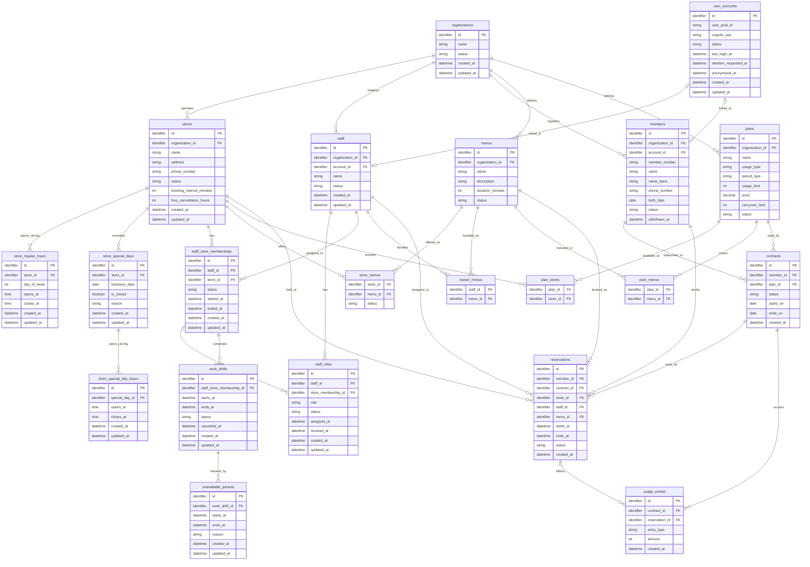

# テーブル設計書

## 全体ER図（たたき台）

Phase 1の主要なデータと関係を示す。列名、型、制約は仮置きであり、各テーブルを確認しながら確定する。営業時間、役割、変更履歴などの補助的なテーブルも、その際に追加する。図の型は概要を読むための表記であり、PostgreSQLの型は未決定である。

最初に確認する関係は事業者と店舗とする。一つの事業者は複数の店舗を持ち、各店舗は一つの事業者に属する。`stores.organization_id`は`organizations.id`を指す。

## organizations（事業者）

1行が、SaaSを利用するジム事業者1つを表す。事業者の店舗、会員、スタッフなどを結びつける起点となる。

| 列 | 必須 | 意味 |
| --- | --- | --- |
| `id` | はい | 名称が変わっても変わらない事業者の識別子。主キー |
| `name` | はい | 画面などに表示する事業者名 |
| `status` | はい | 現在の利用状態。`preparing`、`active`、`suspended`、`terminated`のいずれか |
| `created_at` | はい | 事業者を登録した日時 |
| `updated_at` | はい | 事業者情報を最後に更新した日時 |

事業者名は変更や重複の可能性があるため、識別には`id`を使用する。登録直後の`status`は`preparing`とし、初期設定の完了を確認してから`active`へ変更する。`status`を変更したときは、変更前後の状態、理由、実行者、日時を履歴として残す。履歴の保存先となるテーブルは、ほかの変更履歴と合わせて設計する。

## stores（店舗）

1行が、事業者に属する店舗1つを表す。一つの事業者に複数の店舗を登録できる。

| 列 | 必須 | 意味 |
| --- | --- | --- |
| `id` | はい | 店舗を識別する主キー |
| `organization_id` | はい | 所属事業者の`organizations.id`を指す外部キー |
| `name` | はい | 画面などに表示する店舗名 |
| `address` | はい | 店舗の住所。Phase 1では一つの文字列として扱う |
| `phone_number` | はい | 店舗の電話番号。先頭の0やハイフンを保持できる文字列として扱う |
| `status` | はい | 現在の店舗状態。`draft`、`active`、`suspended`、`closed`のいずれか |
| `booking_interval_minutes` | はい | 予約を開始できる時刻の間隔。`10`、`15`、`30`分のいずれか |
| `free_cancellation_hours` | はい | 予約開始の何時間前まで無料キャンセルできるか。`0`〜`168`時間 |
| `created_at` | はい | 店舗を登録した日時 |
| `updated_at` | はい | 店舗情報を最後に更新した日時 |

登録直後の`status`は`draft`、予約開始間隔の初期値は`30`分、無料キャンセル期限の初期値は`24`時間とする。新しい予約を受け付けるには、事業者と店舗の両方が`active`であることを確認する。店舗は物理削除せず、過去の契約・予約履歴との関係を保持する。

曜日ごとの通常営業時間は、一日に複数の時間帯を登録できるよう別テーブルで管理する。特定日の休業や時間変更は、通常営業時間より優先する別テーブルで管理する。

## store_regular_hours（通常営業時間）

1行が、1店舗における1曜日の1つの営業時間帯を表す。同じ曜日に昼休みなどを挟む場合は、午前と午後を別の行として登録する。

| 列 | 必須 | 意味 |
| --- | --- | --- |
| `id` | はい | 通常営業時間を識別する主キー |
| `store_id` | はい | 対象店舗の`stores.id`を指す外部キー |
| `day_of_week` | はい | 曜日。ISO 8601に合わせて月曜日を`1`、日曜日を`7`とする |
| `opens_at` | はい | 営業開始時刻 |
| `closes_at` | はい | 営業終了時刻 |
| `created_at` | はい | 営業時間帯を登録した日時 |
| `updated_at` | はい | 営業時間帯を最後に更新した日時 |

`day_of_week`は`1`〜`7`だけを許可し、`opens_at`は`closes_at`より前であることを保証する。同じ店舗・曜日で営業時間帯が重ならないようにする。通常休業する曜日には行を登録しない。

フロントエンドで複数の曜日をまとめて選択した場合、FastAPIは曜日ごとの行へ分け、1つのトランザクションで保存する。

## store_special_days（特定日設定）

1行が、1店舗における通常営業時間を使わない特定日を表す。予約可能時間を計算するとき、対象日がこのテーブルに登録されている場合は`store_regular_hours`を使用せず、特定日の設定を優先する。

| 列 | 必須 | 意味 |
| --- | --- | --- |
| `id` | はい | 特定日設定を識別する主キー |
| `store_id` | はい | 対象店舗の`stores.id`を指す外部キー |
| `business_date` | はい | 通常営業時間を上書きする具体的な日付 |
| `is_closed` | はい | `true`は終日休業、`false`は営業時間を変更して営業することを示す |
| `reason` | いいえ | 休業や営業時間変更の理由 |
| `created_at` | はい | 特定日設定を登録した日時 |
| `updated_at` | はい | 特定日設定を最後に更新した日時 |

`store_id`と`business_date`の組み合わせに一意制約を設定し、同じ店舗・同じ日付は1回だけ登録できるようにする。`is_closed`が`true`の場合は特定日の営業時間を登録せず、`false`の場合は特定日の営業時間を別テーブルへ1件以上登録する。`reason`は管理者が設定理由を確認するための任意入力とする。

## store_special_day_hours（特定日営業時間）

1行が、特定日における1つの営業時間帯を表す。同じ日に昼休みなどを挟む場合は、午前と午後を別の行として登録する。

| 列 | 必須 | 意味 |
| --- | --- | --- |
| `id` | はい | 特定日の営業時間帯を識別する主キー |
| `special_day_id` | はい | 対象となる`store_special_days.id`を指す外部キー |
| `opens_at` | はい | 営業開始時刻 |
| `closes_at` | はい | 営業終了時刻 |
| `created_at` | はい | 営業時間帯を登録した日時 |
| `updated_at` | はい | 営業時間帯を最後に更新した日時 |

`opens_at`は`closes_at`より前であることを保証し、同じ`special_day_id`に属する営業時間帯が重ならないようにする。親となる`store_special_days.is_closed`が`false`の場合は1件以上登録し、`true`の場合は登録しない。

特定日の予約可能時間を計算するときは、このテーブルの時間帯を使用し、`store_regular_hours`の曜日設定は使用しない。

## user_accounts（ログインアカウント）

1行が、Cognitoで認証される1つのログインアカウントを表す。Cognitoがパスワード、ログイン用メールアドレス、メール確認状態およびMFA設定を管理し、このテーブルはCognitoの利用者とPostgreSQL上の業務プロフィールを結び付ける。

| 列 | 必須 | 意味 |
| --- | --- | --- |
| `id` | はい | ログインアカウントを識別する主キー |
| `user_pool_id` | はい | 利用者が所属するCognito User PoolのID |
| `cognito_sub` | はい | User Pool内で利用者を一意に識別するCognitoの`sub` |
| `status` | はい | `active`、`disabled`、`deletion_pending`または`anonymized` |
| `last_login_at` | いいえ | 最後にログインした日時 |
| `deletion_requested_at` | いいえ | サービスアカウントの削除申請を受理した日時 |
| `anonymized_at` | いいえ | 不要な個人情報との紐づけを削除または匿名化した日時 |
| `created_at` | はい | ログインアカウントを登録した日時 |
| `updated_at` | はい | ログインアカウントを最後に更新した日時 |

`user_pool_id`と`cognito_sub`の組み合わせに一意制約を設定する。`sub`はUser Pool内では一意だが、会員用、スタッフ用およびSaaS運営者用のUser Poolをまたいだ一意性は保証されないため、User Pool IDと組み合わせて利用者を特定する。

初期状態は`active`とする。`disabled`はログインを停止した状態、`deletion_pending`は削除申請後の処理待ち、`anonymized`は業務履歴を残したまま認証情報や個人情報との紐づけを解除した状態を表す。Cognito側の利用者状態も同時に更新し、このテーブルの状態変更だけでログイン制御を完結させない。

会員、スタッフまたはSaaS運営者の氏名、所属および役割は、このテーブルへ重複して保存せず、それぞれの業務プロフィール側で管理する。各プロフィールとの具体的な外部キーおよび多重度は、対象テーブルを詳細化するときに確定する。

## staff（スタッフ）

1行が、1つの事業者に所属する1人のスタッフの業務プロフィールを表す。スタッフは招待を送った時点で作成でき、招待承諾後にCognitoのログインアカウントと結び付ける。ログインアカウントを作成する前の招待中スタッフも扱えるよう、`account_id`は任意とする。

| 列 | 必須 | 意味 |
| --- | --- | --- |
| `id` | はい | スタッフを識別する主キー |
| `organization_id` | はい | 所属する`organizations.id`を指す外部キー |
| `account_id` | いいえ | 招待承諾後に紐付ける`user_accounts.id`を指す外部キー |
| `name` | はい | スタッフの氏名 |
| `status` | はい | `invited`、`active`または`inactive` |
| `created_at` | はい | スタッフを登録した日時 |
| `updated_at` | はい | スタッフ情報を最後に更新した日時 |

初期状態は`invited`とする。`invited`は招待を送ったが利用開始前、`active`は利用中、`inactive`は退職または利用停止中を表す。`inactive`へ変更しても物理削除せず、過去の予約、担当実績および操作履歴を保持する。

`account_id`には一意制約を設定し、1つのログインアカウントを複数のスタッフへ紐付けない。Phase 1ではスタッフの複数事業者への所属を許可しないため、1つのログインアカウントは1つのスタッフプロフィールだけに紐付ける。

役割は1人に複数付与でき、店舗所属も複数持てる。そのため、役割は`staff_roles`、店舗所属は`staff_store_memberships`で別に管理する。スタッフを`inactive`へ変更するときは、Cognito側のログインも無効化し、未来の勤務予定や担当予約への対応を完了してから状態を変更する。

## staff_roles（スタッフ役割）

1行が、1人のスタッフへ付与した1つの役割を表す。固定の役割だけを採用し、事業者ごとの独自ロールや任意の権限の組み合わせはPhase 1の対象外とする。

| 列 | 必須 | 意味 |
| --- | --- | --- |
| `id` | はい | 役割付与を識別する主キー |
| `staff_id` | はい | 対象となる`staff.id`を指す外部キー |
| `store_membership_id` | 条件付き | 店舗に紐付く役割の対象となる`staff_store_memberships.id`を指す外部キー |
| `role` | はい | `organization_admin`、`store_admin`または`trainer` |
| `status` | はい | `active`または`inactive` |
| `assigned_at` | はい | 役割を付与した日時 |
| `revoked_at` | 条件付き | 役割を解除した日時。`inactive`の場合に設定する |
| `created_at` | はい | 役割付与を登録した日時 |
| `updated_at` | はい | 役割付与を最後に更新した日時 |

`organization_admin`は事業者全体を操作する役割のため、`store_membership_id`を設定しない。`store_admin`と`trainer`は店舗ごとに権限範囲が異なるため、対象となる店舗所属を`store_membership_id`へ設定する。例えば、同じスタッフが渋谷店では`store_admin`、新宿店では`trainer`として勤務できる。

`staff_id`、`role`および`store_membership_id`の組み合わせに対し、`active`の役割が重複しないようにする。役割を解除するときは物理削除せず、`status`を`inactive`、`revoked_at`を解除日時へ更新して過去の権限と操作履歴を保持する。各事業者には、`organization_admin`かつ`active`のスタッフを最低1人残す。

## staff_store_memberships（スタッフ店舗所属）

1行が、1人のスタッフが1つの店舗へ所属した1つの期間を表す。スタッフの所属事業者と店舗の事業者は一致させ、異なる事業者の店舗へ所属させない。

| 列 | 必須 | 意味 |
| --- | --- | --- |
| `id` | はい | 店舗所属を識別する主キー |
| `staff_id` | はい | 対象となる`staff.id`を指す外部キー |
| `store_id` | はい | 所属先の`stores.id`を指す外部キー |
| `status` | はい | `active`または`inactive` |
| `started_at` | はい | 店舗への所属を開始した日時 |
| `ended_at` | 条件付き | 所属を終了した日時。`inactive`の場合に設定する |
| `created_at` | はい | 所属情報を登録した日時 |
| `updated_at` | はい | 所属情報を最後に更新した日時 |

初期状態は`active`とする。`active`の所属だけを、新しい勤務予定の作成、予約の担当者および店舗に紐付く役割の対象として選択できる。`inactive`へ変更する前に、未来の勤務予定を取り消し、担当予約を別のスタッフへ変更またはキャンセルする。

同じスタッフと店舗について、`active`の所属が重複しないようにする。所属終了後も物理削除せず、`status`を`inactive`、`ended_at`を終了日時へ更新して過去の勤務予定、担当予約および利用実績を保持する。再雇用や再配属では新しい所属期間として別の行を作成する。

## work_shifts（トレーナー勤務予定）

1行が、トレーナーの1つの勤務時間帯を表す。毎週繰り返すテンプレートではなく、実際の日付と開始・終了日時を指定して登録する。複数日分を登録する場合も、日ごとの勤務時間帯へ分けて複数の行を作成する。

| 列 | 必須 | 意味 |
| --- | --- | --- |
| `id` | はい | 勤務予定を識別する主キー |
| `staff_store_membership_id` | はい | 勤務するスタッフの店舗所属を指す`staff_store_memberships.id`の外部キー |
| `starts_at` | はい | 勤務開始日時 |
| `ends_at` | はい | 勤務終了日時 |
| `status` | はい | `scheduled`または`cancelled` |
| `cancelled_at` | 条件付き | 勤務予定を取り消した日時。`cancelled`の場合に設定する |
| `created_at` | はい | 勤務予定を登録した日時 |
| `updated_at` | はい | 勤務予定を最後に更新した日時 |

新しい勤務予定は、対象の`staff_store_memberships`が`active`であり、同じ店舗所属に対して`trainer`役割が有効な場合だけ作成できる。`starts_at`は`ends_at`より前であり、勤務時間帯は対象店舗の営業時間内に収める。

同一スタッフについて、店舗が異なる場合も含めて、`scheduled`の勤務時間帯が重ならないようにする。PostgreSQLの範囲型と排他制約を使用して、同時に登録操作が行われても重複勤務を拒否する。過去の勤務予定は変更せず、未来の予定を取り消す場合は`status`を`cancelled`、`cancelled_at`を取消日時へ更新する。既存予約と重なる勤務予定の短縮または取消は許可しない。

## unavailable_periods（予約不可時間）

1行が、1つの勤務予定の中で予約を受け付けない時間帯を表す。休憩や研修などを登録し、勤務時間全体を変更せずに予約可能時間だけを除外する。

| 列 | 必須 | 意味 |
| --- | --- | --- |
| `id` | はい | 予約不可時間を識別する主キー |
| `work_shift_id` | はい | 対象となる`work_shifts.id`を指す外部キー |
| `starts_at` | はい | 予約不可開始日時 |
| `ends_at` | はい | 予約不可終了日時 |
| `reason` | はい | `break`または`other` |
| `created_at` | はい | 予約不可時間を登録した日時 |
| `updated_at` | はい | 予約不可時間を最後に更新した日時 |

`starts_at`は`ends_at`より前であり、対象の勤務予定の開始から終了までの範囲に収める。同じ`work_shift_id`に属する予約不可時間は重複させない。PostgreSQLの範囲型と排他制約を使用して、同時に登録操作が行われても重複を拒否する。

予約不可時間が既存予約と重なる場合は、新たに登録または変更できない。過去の勤務予定に属する予約不可時間は変更しない。予約可能時間を計算するときは、勤務予定からこのテーブルの時間帯と既存予約を除外する。
