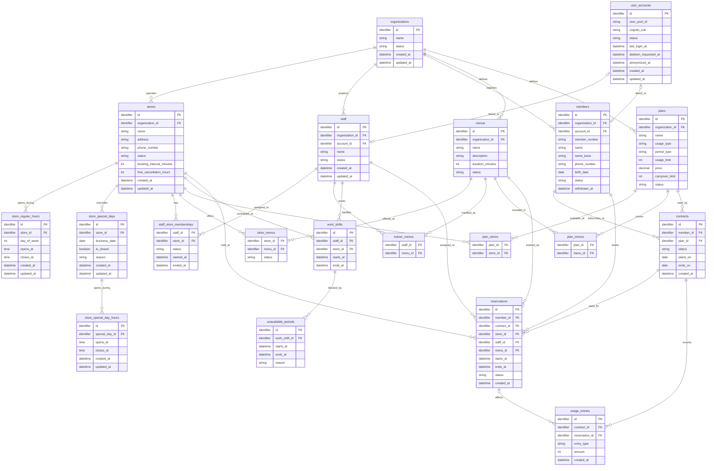

# テーブル設計書

## 全体ER図（たたき台）

Phase 1の主要なデータと関係を示す。列名、型、制約は仮置きであり、各テーブルを確認しながら確定する。営業時間、役割、変更履歴などの補助的なテーブルも、その際に追加する。図の型は概要を読むための表記であり、PostgreSQLの型は未決定である。

最初に確認する関係は事業者と店舗とする。一つの事業者は複数の店舗を持ち、各店舗は一つの事業者に属する。`stores.organization_id`は`organizations.id`を指す。

## organizations（事業者）

1行が、SaaSを利用するジム事業者1つを表す。事業者の店舗、会員、スタッフなどを結びつける起点となる。

| 列 | 必須 | 意味 |
| --- | --- | --- |
| `id` | はい | 名称が変わっても変わらない事業者の識別子。主キー |
| `name` | はい | 画面などに表示する事業者名 |
| `status` | はい | 現在の利用状態。`preparing`、`active`、`suspended`、`terminated`のいずれか |
| `created_at` | はい | 事業者を登録した日時 |
| `updated_at` | はい | 事業者情報を最後に更新した日時 |

事業者名は変更や重複の可能性があるため、識別には`id`を使用する。登録直後の`status`は`preparing`とし、初期設定の完了を確認してから`active`へ変更する。`status`を変更したときは、変更前後の状態、理由、実行者、日時を履歴として残す。履歴の保存先となるテーブルは、ほかの変更履歴と合わせて設計する。

## stores（店舗）

1行が、事業者に属する店舗1つを表す。一つの事業者に複数の店舗を登録できる。

| 列 | 必須 | 意味 |
| --- | --- | --- |
| `id` | はい | 店舗を識別する主キー |
| `organization_id` | はい | 所属事業者の`organizations.id`を指す外部キー |
| `name` | はい | 画面などに表示する店舗名 |
| `address` | はい | 店舗の住所。Phase 1では一つの文字列として扱う |
| `phone_number` | はい | 店舗の電話番号。先頭の0やハイフンを保持できる文字列として扱う |
| `status` | はい | 現在の店舗状態。`draft`、`active`、`suspended`、`closed`のいずれか |
| `booking_interval_minutes` | はい | 予約を開始できる時刻の間隔。`10`、`15`、`30`分のいずれか |
| `free_cancellation_hours` | はい | 予約開始の何時間前まで無料キャンセルできるか。`0`〜`168`時間 |
| `created_at` | はい | 店舗を登録した日時 |
| `updated_at` | はい | 店舗情報を最後に更新した日時 |

登録直後の`status`は`draft`、予約開始間隔の初期値は`30`分、無料キャンセル期限の初期値は`24`時間とする。新しい予約を受け付けるには、事業者と店舗の両方が`active`であることを確認する。店舗は物理削除せず、過去の契約・予約履歴との関係を保持する。

曜日ごとの通常営業時間は、一日に複数の時間帯を登録できるよう別テーブルで管理する。特定日の休業や時間変更は、通常営業時間より優先する別テーブルで管理する。

## store_regular_hours（通常営業時間）

1行が、1店舗における1曜日の1つの営業時間帯を表す。同じ曜日に昼休みなどを挟む場合は、午前と午後を別の行として登録する。

| 列 | 必須 | 意味 |
| --- | --- | --- |
| `id` | はい | 通常営業時間を識別する主キー |
| `store_id` | はい | 対象店舗の`stores.id`を指す外部キー |
| `day_of_week` | はい | 曜日。ISO 8601に合わせて月曜日を`1`、日曜日を`7`とする |
| `opens_at` | はい | 営業開始時刻 |
| `closes_at` | はい | 営業終了時刻 |
| `created_at` | はい | 営業時間帯を登録した日時 |
| `updated_at` | はい | 営業時間帯を最後に更新した日時 |

`day_of_week`は`1`〜`7`だけを許可し、`opens_at`は`closes_at`より前であることを保証する。同じ店舗・曜日で営業時間帯が重ならないようにする。通常休業する曜日には行を登録しない。

フロントエンドで複数の曜日をまとめて選択した場合、FastAPIは曜日ごとの行へ分け、1つのトランザクションで保存する。

## store_special_days（特定日設定）

1行が、1店舗における通常営業時間を使わない特定日を表す。予約可能時間を計算するとき、対象日がこのテーブルに登録されている場合は`store_regular_hours`を使用せず、特定日の設定を優先する。

| 列 | 必須 | 意味 |
| --- | --- | --- |
| `id` | はい | 特定日設定を識別する主キー |
| `store_id` | はい | 対象店舗の`stores.id`を指す外部キー |
| `business_date` | はい | 通常営業時間を上書きする具体的な日付 |
| `is_closed` | はい | `true`は終日休業、`false`は営業時間を変更して営業することを示す |
| `reason` | いいえ | 休業や営業時間変更の理由 |
| `created_at` | はい | 特定日設定を登録した日時 |
| `updated_at` | はい | 特定日設定を最後に更新した日時 |

`store_id`と`business_date`の組み合わせに一意制約を設定し、同じ店舗・同じ日付は1回だけ登録できるようにする。`is_closed`が`true`の場合は特定日の営業時間を登録せず、`false`の場合は特定日の営業時間を別テーブルへ1件以上登録する。`reason`は管理者が設定理由を確認するための任意入力とする。

## store_special_day_hours（特定日営業時間）

1行が、特定日における1つの営業時間帯を表す。同じ日に昼休みなどを挟む場合は、午前と午後を別の行として登録する。

| 列 | 必須 | 意味 |
| --- | --- | --- |
| `id` | はい | 特定日の営業時間帯を識別する主キー |
| `special_day_id` | はい | 対象となる`store_special_days.id`を指す外部キー |
| `opens_at` | はい | 営業開始時刻 |
| `closes_at` | はい | 営業終了時刻 |
| `created_at` | はい | 営業時間帯を登録した日時 |
| `updated_at` | はい | 営業時間帯を最後に更新した日時 |

`opens_at`は`closes_at`より前であることを保証し、同じ`special_day_id`に属する営業時間帯が重ならないようにする。親となる`store_special_days.is_closed`が`false`の場合は1件以上登録し、`true`の場合は登録しない。

特定日の予約可能時間を計算するときは、このテーブルの時間帯を使用し、`store_regular_hours`の曜日設定は使用しない。

## user_accounts（ログインアカウント）

1行が、Cognitoで認証される1つのログインアカウントを表す。Cognitoがパスワード、ログイン用メールアドレス、メール確認状態およびMFA設定を管理し、このテーブルはCognitoの利用者とPostgreSQL上の業務プロフィールを結び付ける。

| 列 | 必須 | 意味 |
| --- | --- | --- |
| `id` | はい | ログインアカウントを識別する主キー |
| `user_pool_id` | はい | 利用者が所属するCognito User PoolのID |
| `cognito_sub` | はい | User Pool内で利用者を一意に識別するCognitoの`sub` |
| `status` | はい | `active`、`disabled`、`deletion_pending`または`anonymized` |
| `last_login_at` | いいえ | 最後にログインした日時 |
| `deletion_requested_at` | いいえ | サービスアカウントの削除申請を受理した日時 |
| `anonymized_at` | いいえ | 不要な個人情報との紐づけを削除または匿名化した日時 |
| `created_at` | はい | ログインアカウントを登録した日時 |
| `updated_at` | はい | ログインアカウントを最後に更新した日時 |

`user_pool_id`と`cognito_sub`の組み合わせに一意制約を設定する。`sub`はUser Pool内では一意だが、会員用、スタッフ用およびSaaS運営者用のUser Poolをまたいだ一意性は保証されないため、User Pool IDと組み合わせて利用者を特定する。

初期状態は`active`とする。`disabled`はログインを停止した状態、`deletion_pending`は削除申請後の処理待ち、`anonymized`は業務履歴を残したまま認証情報や個人情報との紐づけを解除した状態を表す。Cognito側の利用者状態も同時に更新し、このテーブルの状態変更だけでログイン制御を完結させない。

会員、スタッフまたはSaaS運営者の氏名、所属および役割は、このテーブルへ重複して保存せず、それぞれの業務プロフィール側で管理する。各プロフィールとの具体的な外部キーおよび多重度は、対象テーブルを詳細化するときに確定する。
